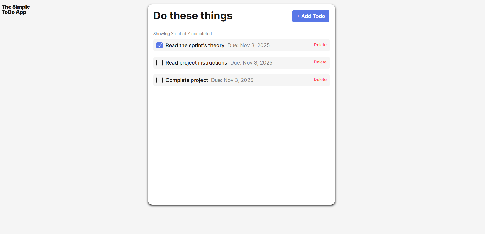
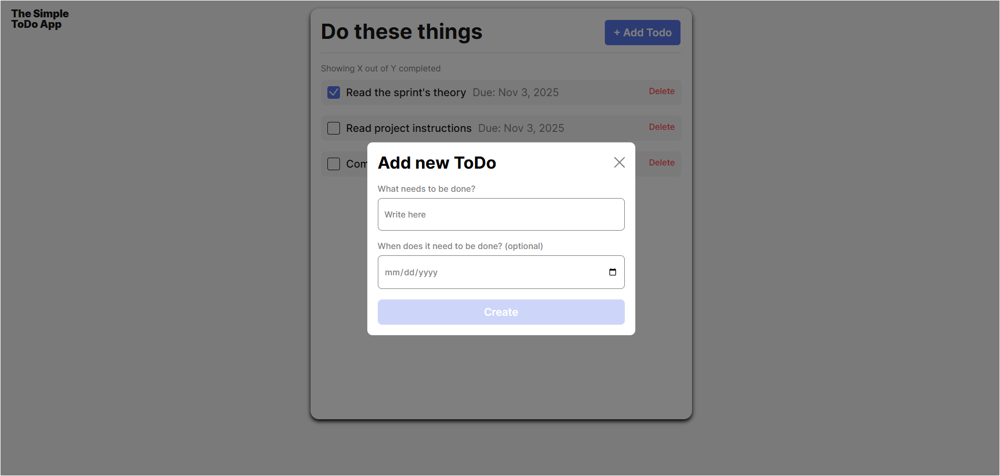

# Simple Todo App

### Simple To-Do App

#### This project is deployed on GitHub Pages :

#### https://lunkant.github.io/se_project_todo-app/

A clean, interactive web application that helps users organize daily tasks.
Users can add, check off, and delete to-dos, each with an optional due date.
The app also features built-in validation to ensure only valid tasks are added, and it automatically resets the form after each successful submission.

### Functionality

Add Tasks: Create new to-do items with a name and optional due date.

Mark as Complete: Check off tasks to visually indicate completion.

Delete Tasks: Remove tasks individually using the “Delete” button.

Form Validation: Prevents submitting empty or invalid tasks.

Automatic Reset: After a successful submission, the form clears and disables the button until valid input is entered again.

Responsive Design: Works smoothly on desktop and mobile screens.

### Technology

HTML5 – provides the app’s structure and semantic layout.

CSS3 / Flexbox – used for styling, layout, and responsiveness.

JavaScript– adds interactivity, event handling, and dynamic DOM updates.

Reusable Classes:

Todo – handles individual task creation, completion, and deletion.

FormValidator – manages input validation, error display, and button state.

UUID Library – generates unique IDs for each to-do item.

GitHub Pages – hosts the live version of the project for public access.

### Screenshots

Main To-Do List View:

Add New To-Do Popup:

🚀 Deployment

## This project is deployed on GitHub Pages and publicly accessible here:

## https://lunkant.github.io/se_project_todo-app/
